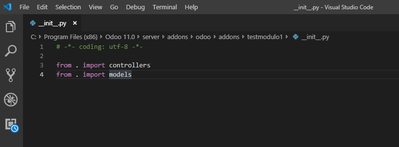

# Lab. 2: ADMINISTRACI�N DE M�DULOS ODOO

## Desarrollo

3.6. Aplique los Filtros �Apps� e �instalado� simult�neamente para ver los m�dulos instalados actualmente:  
 

4.1 Identificaci�n del �Tablero� de opciones  

Tablero1--> Gesti�n de Ausencias 
Tablero2-->M�dulo Punto de Venta 
Tablero3--> M�dulo Gesti�n de Ventas 

4.2. Opciones de configuraci�n de ODOO. Elija la opci�n Configuraci�n  

Se observa que en el menu de ajustes o configuraci�n se tiene la opci�n de
activar el modo desarrollador , que nos brinda m�s opciones en el tablero, ademas
que nos muestra un men� pensdo e nlos desarrolladores 

5. Creación de un módulo en ODOO 
    
   5.7 Verificacion de la existencia de la carpeta testmodulo1 
     
   ComandoParaCrearModulo.png 
   5.9 Archivo **init**.py  
    
   5.10. **manifest**.py  
     
   5.14 Instalando m�dulo creado testmodulo1  
     
   5.15.Ver Opcion de desinstalar 
    
   5.17. Desinstalando el m�sulo testm�dulo1 
    

## **Tarea**

1. Tabla de funcionalidades: 
    

## Observaciones y Conclusiones

- Se observa que odoo cuenta con una herramienta que nos permite crear m�dulos completos para
  poder empezar a programar, adem�s se ve que para crear un m�dulo es necesario
  hacerlo desde la raiz de odoo , ingresar al servidor
- Se observa que los m�dulos de odoo se encuentran en la carpeta addons
- Se observa que ODoo UTILIZA una arquitectura MVC
- Se vi� que la diferencia entre los m�dulos o aplicaciones; es que en los primeros son bloques
  para la construccion de las apps de odoo, un m�dulo puede agregar o modificar caracteriticas
  en odoo.En cambio las apps proporcionan una caracteristica central, alrededor de la cual otros m�dulos
  agregan caracter�sticas.
- Se ley� en la documentaci�n de odoo11 la recomendaci�n de no modificar modulos existentes , esto es
  considerado un mala pr�ctica, pero si debemos crear m�dulos nuevos que sean plaicados sobe los m�dulos que
  queremos modificar, e implementar , ya que odoo permite realizar herencia .
- Este laboratorio permiti�:Instalar Aplicaciones, Crear un m�dulo , actualizar la tabla en el servidor de oddo e instalar el m�dulo creado
- Se pueden realizar busquedas avanzadas, por medio de filtros, Agrupaciones y/o favoritos;
  asimismo se vi� como instalacr una aplicaci�n o un m�dulo.
- Al instalar una aplicaci�n se observa que en la barra de menu aparece una nuevo menu,
  en cambio al instalar un m�dulo aparecen mas de una aplicacion instalada , de modo que se a�ade m�s
  de un men� en la barra de men�s
- Identificaci�n del tablero de opciones.
- Diferencia entre aplicaciones y modulos.
- Se observa que al instalar una app se muesta como un menu extra en la parte superior
  oca github , es el repositorio para buscar de maner confiable.
