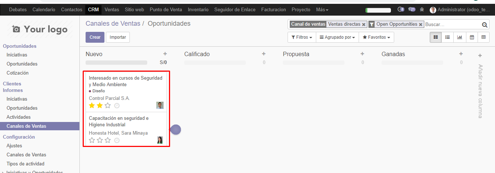

# Lab. 3: CRM en ODOO

## Desarrollo

1.  Inicio del software ODOO
2.  Instalación del módulo CRM
3.  Configuración ODOO CRM- planificador de Ventas
    

        3.3. Ingresando las expectativas de su estrategia

    Expectativas
    
    3.4. Ingresando los KPIs de su estrategia
    
    3.5. Configurando el flujo de trabajo para su estrategia
    
    3.6. Configurando el tipo de propuesta de venta de productos o servicios
    3.7. Revissión de recomendaciones de la ventana "correos electronicos entrantes"
    3.8. Revisión de las opciones disponibles para Crear clientes
    3.9. Revisión de las opciones disponibles para Crear Productos
    3.10. Revisión de las opciones disponibles para definir precios & descuentos
    3.11. Revisión de las opciones disponibles para definir los Informes.
    3.12. Revisión de las opciones disponibles para Personalizaciones
    3.13. Revisión de las opciones disponibles en Reuniones Semanales.
    3.14. Revisión de las opciones disponibles en Herramientas de ventas.
    3.15. Revisión de las opciones disponibles en Añadir características.
    3.16. Pantalla de finalización.
    

4.  Configuración ODOO CRM - Clientes
    4.1. Tablero clientes en el menú Ventas
    4.2. Creando un cliente
    4.3. Ingreando datos del nuevo cliente
    
    4.4. crear nuevo contacto de la compañia
    4.5. Ingresando datos del nuevo contacto
    
    4.6. Asignando nueva imagen al nuevo cliente
    4.7. Descarga de imagen
    4.8. Verificación de imagen
    4.9. Guardar nuevo cliente
    4.10. Cargar nuevo clientes.
    
5.  Equipo de Ventas
    5.6.
    
    5.7.
    
    5.8.
    5.9.
    5.10.
    5.11.
    
    5.12.
    
6.  Iniciativas y/o oportunidades en ODOO (Leads)
    6.1. descripcion de las inicaitivas
    6.2. Adicionar manualmente un contacto
    
    6.3.
    6.4. Creando una iniciativa
    6.5. Datos de la nueva iniciativa
    
    6.6. guardar el nuevo contacto de la iniciativa
    6.7. Convertir en una oportunidad
    
    6.8.
    6.9.
    
    6.10.
    
    6.11.
    .png>)
    Crear NUEVA OPORTUNIDAD
7.  .png>)
    Instalando WebSite Builder
    7.3.
    
    7.5. configurando la visualizacion de un nuevo cover
    
    7.8 Instalando el módulo de Formulario de Contacto
    
    7.10. Utilizando el formulario
    
    7.11. Visualizando el mensaje de confirmación
    
    7.12. Se visualiza que la iniciativa desde el sitio web ahora se encuetnra en CRM
    
    7.14. Ingresando datos para convertir oportunidad.
    
    7.15. Ver en la opicion de flujo de Ventas y verificar la nueva oportunidad.
    
    7.16. Desplazar la nueva oportunidad a la columna CALIFICADO(use drag & drop)
    

### Ejercicio:

    7.17. crear 2 nuevas oportunidades empleando el formulario de contacto (adjunte imágenes de los datos ingresados en el formulario contáctenos, adjunte imágenes de la vista Kanban donde se visualicen las 2 nuevas oportunidades)

    1. Se llenan dos formularios y se envìan
    2. Se visualizan las iniciativas paara convertirlas en oportunidades:
    
    3. Se eligen las iniciativas para convertiralas en oportunidades
    
    4.Se ingresan datos para conversion de oportuniades, como el canal de venta
    
    5.Se visualiza las iniciativas en la vista kanban , pero ahora como oportunidades.
    

## **Tarea**

1. Describa el procedimiento para importar contactos/clientes desde un CSV(Revise la documentación)
   Se va al tablero de CLIENTES de la aplicacion de ventas:
   
   1.1. Seguidamente se hace clic en el botón de IMPORTAR, y alli cargar el archivo
   
   1.2. Configurando la carga del archivo csv; así como la coincidencia de los campos, estos pueden ser editables.
   
   1.3. Verificación de clientes impotados.
   
2. Mejore la presentación del módulo Website instalado adicionando mayor cantidad de elementos disponibles en sus editor.
   

## Observaciones y Conclusiones

- Se aprendió de los recursos y componentes de un CRM
- Se aprendió que el módulo del CRM nos permite llevar una mejor gestión del cliente.
- Se vió que en la instalación del módulo de CRM , podemos adminstrar los contactos,
  poder crear iniciativas, y estas iniciativas se convierten en oportunidades y/o clientes.
  Se puden realizar presupuesmtos,de modo que una entrada manual(como un formulario del módulo de
  Aplicación Web); una campaña podían convertirse en iniciativas ; seguidamente estas ultimas podían
  ser un nuevo contacto que finalmente puede ser ganado o perdido, por medio de la gestión que se lleve
  el vendedor.
- Se aprendió a realizar configuracion de los clientes, asi como los equivos de ventas o canales de ventas.
