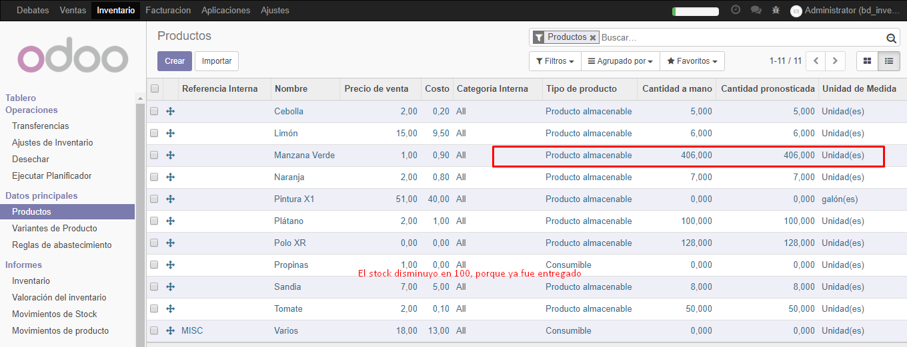

# Lab. 5: MÓDULO VENTAS

## Desarrollo

1.  Instalación de Módulo Ventas.
2.  Creación de Cotización a cliente
    

    - Verifiación de la creación de la cotización

3)  Entrega de productos de una Cotización
    

    - Se verifica que el stock disminuye porque ya se hizo la entrega
      
    - Se envió por correo
      
    - Se vio la impresión en .pdf
      

4)  Facturación y registro de pago de una Cotización
    

    - Verificación de la conexion de la factura con el cliente.
      
    - Factura/registrar pago
      
    - Se observa la factura como abierta por tener un saldo pendiente.
      

5)  Configuración de envío de Correos
    

    - Se edito el correo y la contraseña en el correo saliente
      
    - Configurando el correo saliente, editando datos
      
    - Se acepta el correo de salida al hacer la verificación
      
    - Verificación de la llegada del email al cliente
      

6)  Cambio de secuencia

    - Se edita el tamaño y formato de una cotización
      
    - Verificacion de la secuencia editada
      

7)  Listas de precios

    - Se hace cambio en Ajustes para habilitar la opción de múltiples precios de un producto
      
    - Se agrega al producto las tarifas de nayorista y tarifa pública
      
    - Se crea una cotización viendo la opción de Lista De Precios.
      
    - En la edición de cliente se observa que aparece la opcion de Lista de precios de venta en la subpestaña Ventas y Compras.
      
    - También podemos habilitar la opción de precios calculados a partir de fórmulas como descuentos , márgenes y redondeos.

8)  Portal del cliente
    - Editando el acceso al cliente para que tenga acceso al portal
      
    - Se ve el correo que llega al haberle dado acceso al cliente.
      
    - Estableciendo una nueva contraseña
      
    - Verificación del acceso al portal
      
    - Verificación que el cliente puede actualziar sus datos
      

## **Tarea**

1. Crear una cotización, validarla y registrar una factura por pago previo (La cotización será de S/1000.00 y la primera factura será de S/200.00, la otra por el restante)

   - Creamos la cotización
     
   - Se confirma la Venta y el presupuesto ha sido enviado.
   - Ahora se ve que aparece la conexión con el módulo inventario como una oden de entrega por hacer
     
   - Validación para realizar la entrega
     
   - Creación de Factura
     
   - Veremos por la validacion
     
   - Ahora se Registra El Pago, donde se pondra dos montos para pagar
     
     -Se hace el pago y se registra el segundo pago
     

- DESDE EL LADO DEL CLIENTE

  - Ahora hacemos el envio de la primera factura
    
  - Verificación del envio de la Favtura
    
  - Verificación del segundo envío de la factura
    

2. Adjunte una captura del proceso, de cómo verá el cliente mediante su portal web a la factura, al inicio de ser emitida, luego del primer pago, y finalmente cuando está pagada totalmente.

   - Ingresar al link de portal desde gmail
     
   - Ingresar las credenciales
     
     

## Observaciones y Conclusiones

- Se vió que los componentes del módulo de ventas permite
- crear una cotización, donde podemos editar la informacion del cliente ; esta cotización pasa por tres etapas la de ser cotización , convertirse en presupuesto enviado y finalmente ordenes de venta.Al convertirse en orden de venta falta hacer la entrega de la misma y la facturación.
- Se aprendió que al realizar la cotizacion y convertirse en orden de entrega este proceso pasa al módulo de Inventario como una orden pendiente , una orden de entrega, que nos permite comprobar la disponibilidad en cuanto al stock.
- Se observó que una orden de entrega dentro de inventarios tiene como estados, borrador, esperando, listo y realizando.
- Se vio el elemento de Facturación que se puede hacer de 4 modos, linea de factura con o sin deduccion de pagos anticipados, adelanto d epago por % y pago anticipago con cantidad fija.

- Una factura posee los procesos de borrador , abierto y pagado.
- Se observa la conexión entre los módulos de inventarios y ventas.
- ODOO utiliza un servdor SMTP de correo también aprendimos que un cliente
  puede tener acceso al portal de odoo para que tengo accesoa al actualziacion de sus datos,a demas de ver sus facturas o pedidos realziados.
