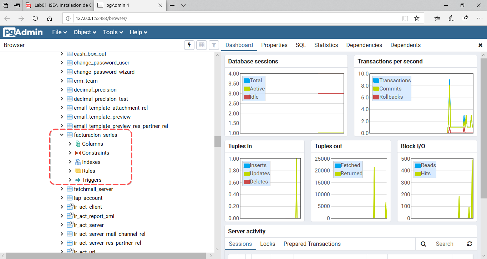
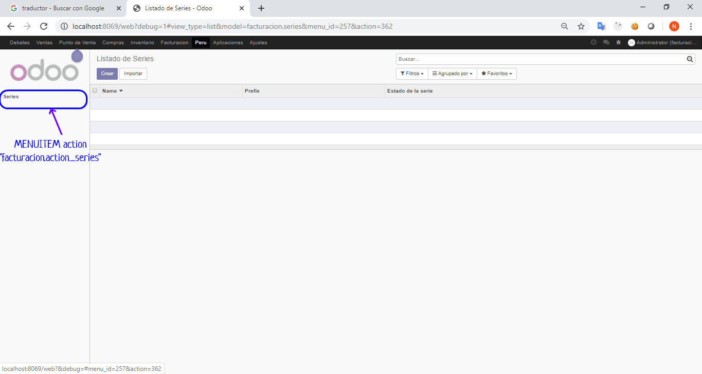
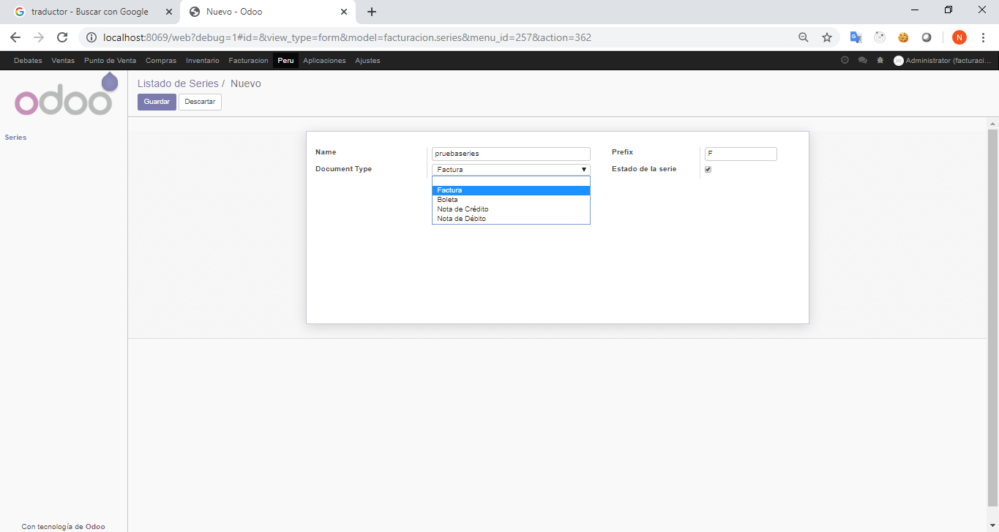
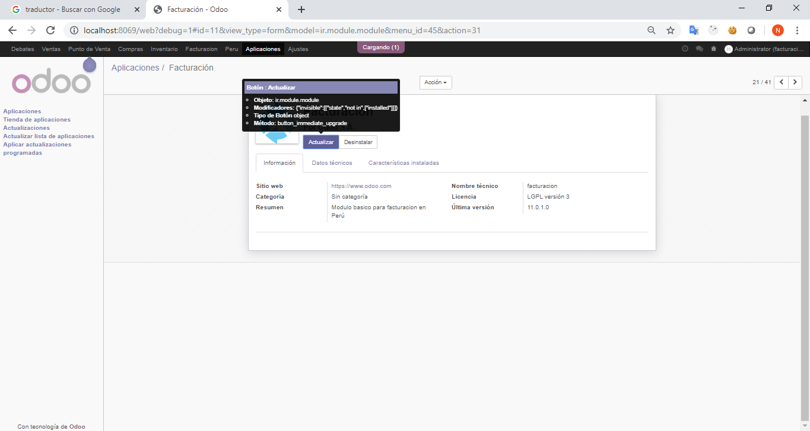
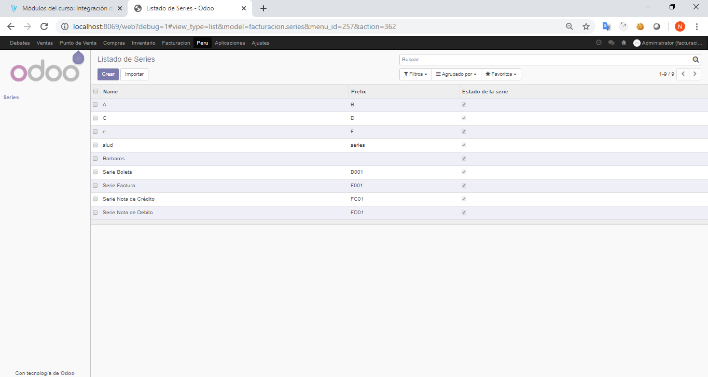
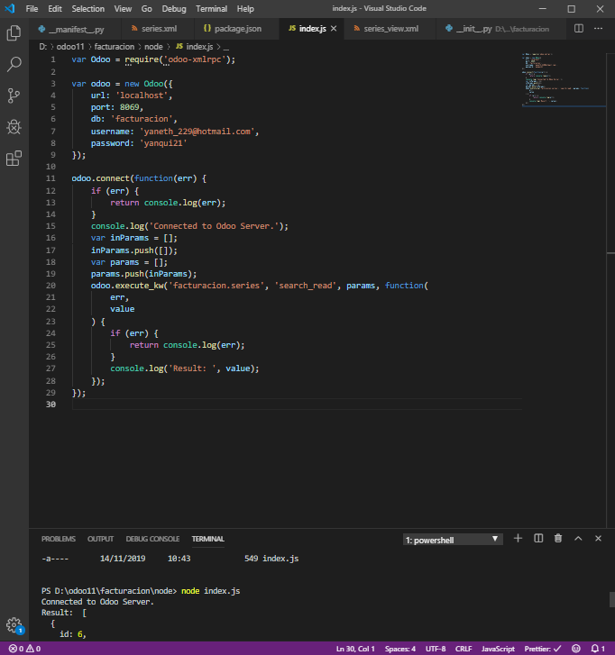
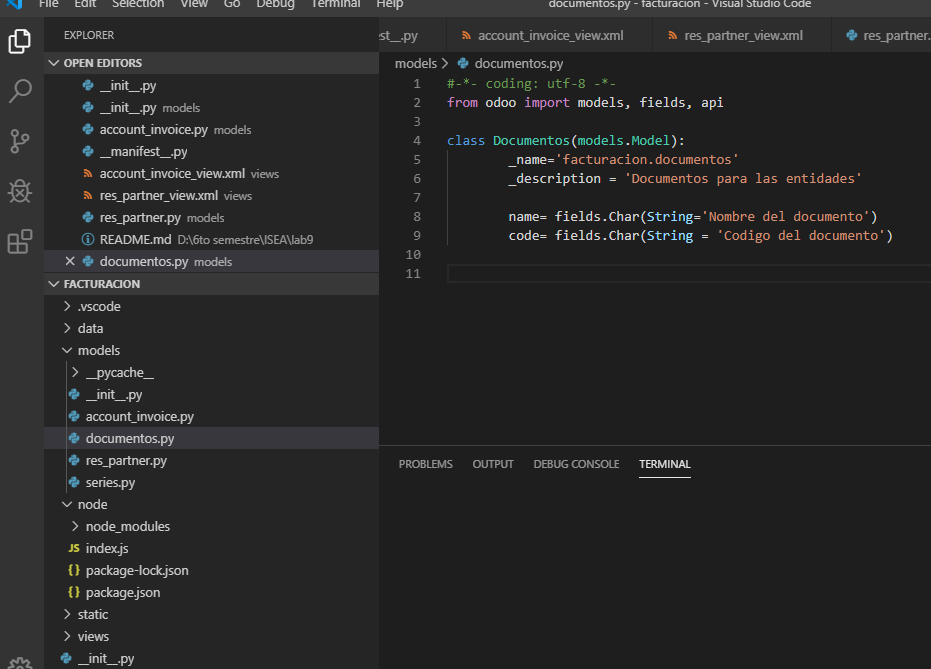
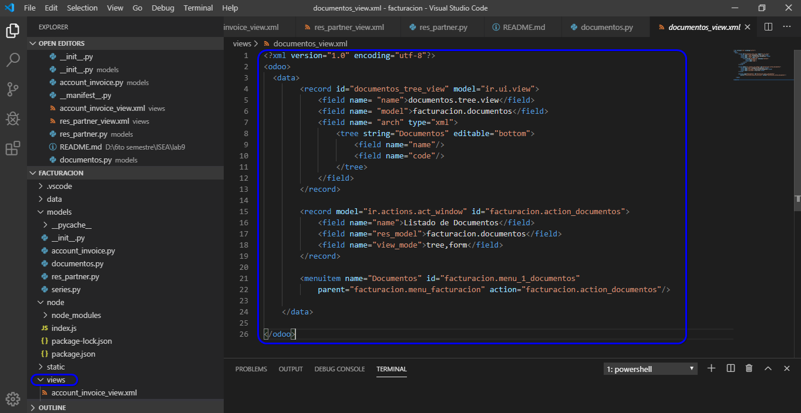
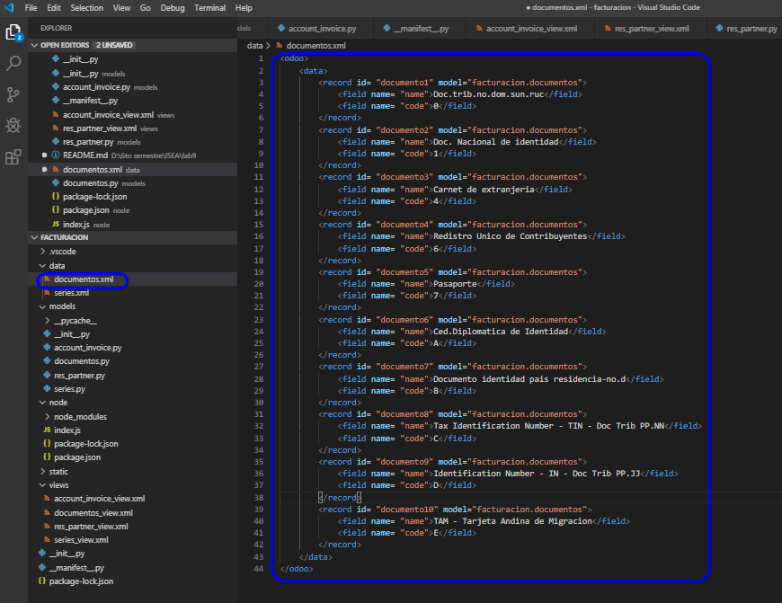

# Lab. 9: MÓDULO BÁSICO Y HERENCIA

## Desarrollo

- 1.  Configuración inicial 
- 2.  Módulos a instalar 
- 3.  Creación de módulo Facturación 
    - 3.5 Visualizacion de la tabla facturacion_series en la base de datos y declarada en el modelo series. 
     
    - 3.6 Visualizacion de la vista del menuitem 
     
    - 3.7 Verificación del Modulo creado de Facturacion  
     

- 4.  Vista de formulario  
    - 4.2 Actualizacion del módulo, debido a cambios de la vista del xml 
     
    - Funcionamiento del listado del nuevo formulario 
     

- 5.  Vista de búsqueda 
    - 5.2 Funcionamiento del listado, puesto que se agregó una nueva forma de búsqueda. 
     

- 6. Data por defecto 
    - 6.3 Verificación de la importanción de la data por defecto generada para este módulo    
     

- 7. Verificación de API automática
    - 7.2 Ejecución del archivo index.js 
     
    - 7.3 ejecutaremos node index.js y adjunte un GIF de la ejecución de dicho comando. 
     

DebugEditarVistaFormulario.png

- 8. Herencia de modelos 
    - 8.5 Verificación de la creación de la vista que permite la creación de facturas 
     

## TAREA

1. Deberá crear el modelo facturacion.documentos basado en el catálogo 6 dentro del siguiente PDF 
    -  
      
2. Deberá crear la data por defecto a importar, basada en el PDF antes proveído. 
     -  

## Observaciones y Conclusiones

- Observamos algunos tipos de campo como char, selection ,boolean y otros.
-  Se crearon modelos, estos mismos se utilizaron en las vistas, de modo que creamos el módulo de facturación.
- En la creacion de un módulo se creo las carpetas static,models (En este archivo tenemos un init donde importamos los archivos de esta carpeta ) description , asi como el archivo manifest , donde se ve las dependencias y la data.
- Se vio la creacion de un buscador por medio de la etiqueta <search> exclusivo de odoo.
- Se vió la creacion de uns vista xml para  tener data por defecto, y es necesario declararlo en el manifest.
- Se vió la creacion de una API por medio de node en la que la llamada a la API nos muestra los regsitros del modelo.
- Se vio la herencia de modelos por medio de _inherit ="nombre del modelo a heredar"
